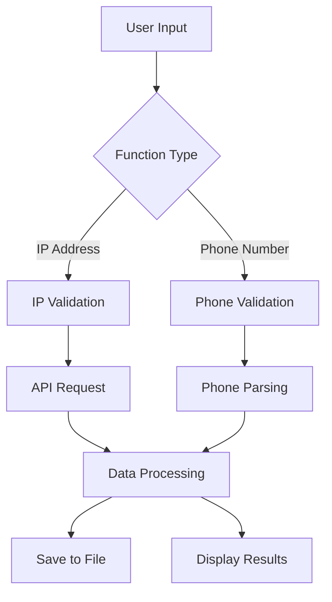

## Architecture Overview

IP-Tracker is a Python-based geolocation and phone analysis tool built with a modular architecture. The application provides two primary capabilities:

1. **IP Geolocation** - Retrieve geographic information for IP addresses using multiple API providers
2. **Phone Number Analysis** - Extract carrier, location, and validation data for international phone numbers

## Module Structure

The tracker.py module is organized into distinct functional groups:

### Core Functionality

<CardGroup cols={2}>
  <Card title="IP Methods" icon="location-dot" href="/api/ip-methods">
    Functions for geolocating IP addresses using multiple API providers
  </Card>
  <Card title="Phone Methods" icon="phone" href="/api/phone-methods">
    Phone number parsing, validation, and information extraction
  </Card>
  <Card title="Utilities" icon="wrench" href="/api/utilities">
    Helper functions for validation, file operations, and UI
  </Card>
</CardGroup>

## Function Organization

### IP Geolocation Functions

- `geolocalizar_ip_metodo1()` - Primary method using ip-api.com
- `geolocalizar_ip_metodo2()` - Alternative method using ipinfo.io
- `validar_ip()` - IP address validation

### Phone Analysis Functions

- `analizar_telefono()` - Interactive phone number analysis
- `validar_telefono()` - Phone number validation

### Utility Functions

- `crear_carpeta_resultados()` - Results directory management
- `limpiar_pantalla()` - Cross-platform screen clearing
- `pausar()` - User input pause
- `banner()` - Application banner display

## Data Flow

## Dependencies

The module relies on the following external libraries:

- **requests** - HTTP requests to geolocation APIs
- **phonenumbers** - Phone number parsing and validation
- **re** - Regular expression validation
- **datetime** - Timestamp generation for results
- **os/sys** - File system and system operations

## Output Format

All analysis functions save results to text files in the `Resultados_Tracker/` directory with timestamped filenames:

- IP results: `IP_{address}_{timestamp}.txt`
- Phone results: `Telefono_{country_code}{number}_{timestamp}.txt`

## Error Handling

Functions implement comprehensive error handling:

- Network timeouts and connection errors
- Invalid input validation
- API error responses
- Parsing exceptions

All errors are displayed with colored console output and functions return `None` on failure.